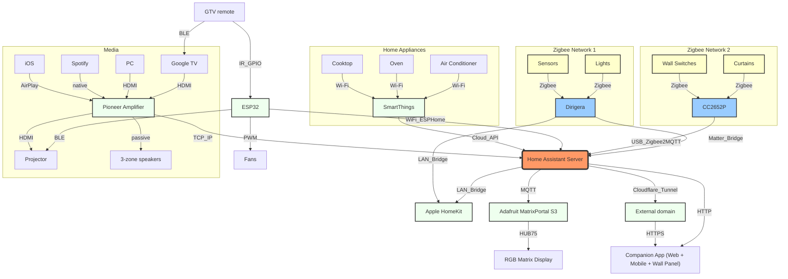

# home-assistant-config


My [Home Assistant](http://home-assistant.io) configuration. The system is running live on Raspberry Pi 4 with Home Assistant OS.

Dashboards are optimized for desktop browser, mobile app and wall panel display.

## Integrations



- [Matter](https://www.home-assistant.io/integrations/matter)
  - IKEA Dirigera Hub
    - Zigbee lights (IKEA, Philips)
    - Temperature, humidity sensors
    - Door sensors
  - Apple Home ([multi fabric](https://www.home-assistant.io/integrations/matter#multi-fabric-join-to-multiple-controllers) provides an independent Dirigera <-> iOS connection)
- [HomeKit Device](https://www.home-assistant.io/integrations/homekit_controller)
  - IKEA Dirigera Hub (not yet fully Matter enabled)
    - Motion sensors
    - Water leakage sensors
  - [Aqara FP2](https://www.aqara.com/eu/product/presence-sensor-fp2/)
    - Human presence sensor
    - Light level sensor
- [Zigbee2MQTT](https://www.zigbee2mqtt.io/)
  - [BSEED](https://www.bseed.com/products/bseed-zigbee-1-2-3gang-1-2-3way-switch-wall-smart-light-switch-for-staircase) [TS0001](https://www.zigbee2mqtt.io/devices/TS0001.html) - wall light switches (with neutral, relays cannot cut off smart bulbs power)
  - [BSEED](https://www.bseed.com/products/bseed-zigbee-eu-wall-sockets-power-outlets-with-energy-monitoring-kids-protection) [TS011F](https://www.zigbee2mqtt.io/devices/TS011F_plug_1.html) - energy monitoring power outlets
  - [IKEA E1743](https://www.zigbee2mqtt.io/devices/E1743.html) - remote light switches
  - [Tuya ERS-10TZBVK-AA](https://www.zigbee2mqtt.io/devices/ERS-10TZBVK-AA.html) - audio knobs
  - [COOLO CS-201Z](https://www.zigbee2mqtt.io/devices/CS-201Z.html) - soil moisture sensors
  - [Aqara C3](https://www.aqara.com/en/product/curtain-controller-c3/) [ZNCLDJ01LM](https://www.zigbee2mqtt.io/devices/ZNCLDJ01LM.html) - curtains
- [MQTT](https://www.home-assistant.io/integrations/mqtt/) - [publishing](https://www.home-assistant.io/integrations/mqtt/#publish--dump-actions) home media states for the pixel display
  - Hardware - board: [AdaFruit MatrixPortal S3](https://learn.adafruit.com/adafruit-matrixportal-s3/)
  - Hardware - display: HUB75 [RGB-Matrix-P2-64x64](https://www.waveshare.com/wiki/RGB-Matrix-P2-64x64), four panels chained
  - OS - [CircuitPython](https://www.adafruit.com/circuitpython)
- [SmartThings](https://www.home-assistant.io/integrations/smartthings/) - home appliances
  - Air conditioner
  - Oven
  - Cooktop
- [Roborock](https://www.home-assistant.io/integrations/roborock/) - robot vacuum cleaner
- [Onkyo](https://www.home-assistant.io/integrations/onkyo/) - Pioneer home cinema (5.1 + Zone 2 + Zone 3)
- [Spotify](https://www.home-assistant.io/integrations/spotify/)
- [Android TV](https://www.home-assistant.io/integrations/androidtv/)
- [HomeKit Bridge](https://www.home-assistant.io/integrations/homekit/) - HASS entities exposed to Apple Home (complements the Matter service)
  - Pioneer home cinema, as Apple media player accessory
  - Curtains
  - Air quality
- [IPP](https://www.home-assistant.io/integrations/ipp/) - Printer
- [OpenAI Conversation](https://www.home-assistant.io/integrations/openai_conversation/)
- [Strava](https://github.com/craibo/ha_strava) - exercises tracking
- [Electricity Maps](https://www.home-assistant.io/integrations/co2signal/) - CO2 intensity of home energy
- [GIOŚ](https://www.home-assistant.io/integrations/gios/) - air quality index
- [ZTM Warsaw](https://github.com/solarssk/ztm_warsaw) - real-time public transport departures from ZTM Warsaw
- [InfluxDB](https://www.home-assistant.io/integrations/influxdb/) - history logging
- [Cloudflared](https://github.com/brenner-tobias/addon-cloudflared) - DNS tunnel for remote access
- [ESPHome](https://www.home-assistant.io/integrations/esphome/) - PWM-controlled fans

## Applications
- Web UI (local & remote)
- [Home Assistant Companion](https://companion.home-assistant.io/) 
  - macOS, iOS, watchOS
  - [Sonoff NSPanel Pro](https://sonoff.tech/en-eu/products/sonoff-nspanel-pro-smart-home-control-panel-86-type) [WebView](https://blakadder.com/android-panel-webview/) [GUIDE](https://www.youtube.com/watch?v=c1Dqdz8yHD) - wall control panel
- [Hass.Agent](https://github.com/hass-agent/hass.agent) - Windows PC

## Household guide

### Quick actions

Quick actions offer a simple way to execute routines at home. They are displayed as a card with buttons, available in both the full desktop home view and the compact mobile wall panel.

The card is illustrated in the image: 

#### Entering and leaving home

Actions are designed to be triggered manually by the user upon entering or leaving the home as part of their daily routine. The system detects whether the user intends to enter or exit the apartment, consolidating both actions into a single button for convenience.

- **Welcome Home**
  - *Condition: no home switches\* are active (indicating the user is outside home)*
  - Sets the lighting scene based on the time of day
    - Between 9 PM and 5 AM, activates the **Lights evening** scene
    - If the sun's elevation is below 5°, activates the **Lights dinner** scene
    - Otherwise, skips the lighting adjustment (daytime)
  - Transfers media playback to the home media player
- **Leave Home**
  - *Condition: one or more home switches\* are active (indicating the user is at home)*
  - Turns all the home lights off
  - Transfers media playback to the mobile device, allowing the continuation of the track outside the home
  - Turns the media player off

\* Enabled switches counter tracks states of the entities listed in [entities/home\_presence.yaml](entities/home_presence.yaml). The list includes selected light switches and media players. If at least one entity is active, we infer home presence. Hall lights are intentionally excluded from the list as they are on both upon entering and leaving the home.

#### Lights scenes

The middle section of the card lists the available home lighting scenes, arranged from the brightest to the dimmest. These scenes can also be activated by **triple-clicking** the corresponding control on the physical six-button switch in the living room, ordered from left to right.

- **Lights on**
  - Turns all the home lights on
  - Maintains the recent brightness and temperature properties
- **Lights focus**
  - Turns the living room lights on brightly
  - Sets cold temperature of 4500 K
- **Lights cooking**
  - Sets lights in a way that is comfortable for cooking
  - Sets kitchen and table lights to bright, 3000 K
  - Dims sofa and desk lights, 2000 K
- **Lights dinner**
  - Sets lights that are comfortable for having a dinner
  - Sets the bright table light, with warm temperature 2500 K
  - Dims kitchen, sofa and desk lights
  - Dims balcony bamboo and bedroom lights
- **Lights evening**
  - Sets dimmed lights suited for late evening relaxation
  - Dims kitchen spot, desk light and bedroom spots to 1% with the warmest 2000 K
  - Turns hall lights, kitchen countertop, table and all ceiling lights off
- **Lights off**
  - Turns all the lights off

#### Lighting automation

The final part of the interface provides controls for lighting automation in rooms without natural light, such as the bathroom and walk-in closet. This feature is available exclusively on the full desktop panel.

- **Lights dim**
  - Dims lights at night, between 10 PM and 6:30 AM
- **Lights motion**
  - Activates lights on motion detection

## Setup

### Overwriting Core Integrations

This project includes customizations to selected core Home Assistant integrations. The modified modules are available in a forked repository: [github.com/skdw/home-assistant-core/tree/skynet](https://github.com/skdw/home-assistant-core/tree/skynet).

To efficiently obtain these customized integrations, perform a sparse checkout of the `skdw/home-assistant-core` repository instead of a full submodule initialization. This method downloads only the necessary files, optimizing the cloning process.
```
cd repos

# History of commits is too long for cloning
# git clone --no-checkout git@github.com:skdw/home-assistant-core.git
# remote: Total 1006214 (delta 115), reused 215 (delta 64), pack-reused 1005899 (from 1)
# Receiving objects: 100% (1006214/1006214), 642.25 MiB | 18.14 MiB/s, done.

# Clone only the latest commit
git clone --no-checkout --depth=1 git@github.com:skdw/home-assistant-core.git
remote: Total 21317 (delta 4059), reused 8738 (delta 2323), pack-reused 0 (from 0)
Receiving objects: 100% (21317/21317), 21.64 MiB | 1.30 MiB/s, done.

# Sparse checkout
cd home-assistant-core/
git sparse-checkout init --cone
git sparse-checkout set homeassistant/components/onkyo
git checkout skynet

# Validate sparse checkout
home-assistant-core git:(skynet) find -type f | wc -l
85
```
